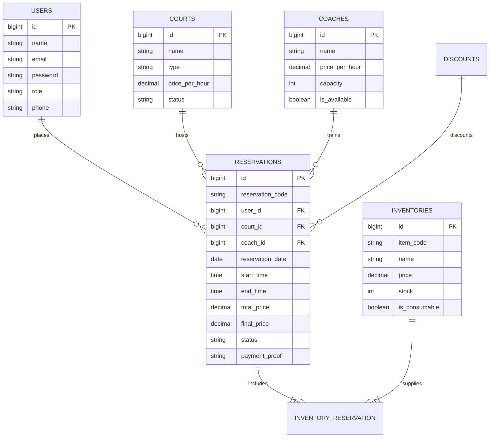

<div align="center">

# 🎾 Padel Arena — Court Reservation & Management System

**A modern, full-featured web-based reservation platform for padel clubs, players, coaches, and administrators.**

[](https://laravel.com)
[](https://php.net)
[](https://www.mysql.com/)
[](https://www.sqlite.org/)
[](LICENSE)

[Fitur Utama](#-fitur-utama) • [Teknologi](#-teknologi-yang-digunakan) • [Instalasi & Setup](#-panduan-instalasi--menjalankan-proyek) • [Akun Demo](#-akun-demo-default) • [Testing](#-pengujian-automated-tests) • [Struktur Proyek](#-struktur-direktori)

</div>

---

## 📌 Tentang Proyek

**Padel Arena** adalah sistem informasi manajemen dan reservasi lapangan padel terintegrasi yang dibangun menggunakan **Laravel**. Aplikasi ini dirancang untuk memudahkan para pemain padel memesan lapangan dan perlengkapan secara online, memilih pelatih profesional, mengunggah bukti pembayaran, serta mencetak tiket booking digital.

Di sisi pengelola, admin memiliki kendali penuh melalui dasbor analitik, manajemen lapangan, pelatih, inventaris (lengkap dengan QR Code generator), kode diskon, pengumuman, hingga fitur pencadangan (backup) dan pemulihan (restore) basis data.

---

## ✨ Fitur Utama

### 👤 Portal Pengguna (Customer / Member)
- **Interactive Court Booking**: Pemilihan tanggal dan pemilihan jam (slot matrix 06:00 - 24:00) secara visual dengan pengecekan ketersediaan jadwal secara real-time melalui AJAX.
- **Coach Booking**: Pilihan pelatih profesional dengan kuota kapasitas harian/per-sesi otomatis agar tidak terjadi *overbooking*.
- **Add-on Rental & Pro Shop**: Sewa raket berbayar, pembelian bola kaleng, handgrip, dan minuman isotonik dalam satu kali transaksi reservasi.
- **Voucher Diskon**: Penerapan kode promo otomatis (diskon persentase `%` maupun potongan nominal `Rp`).
- **Upload Bukti Bayar**: Konfirmasi pembayaran transfer bank dengan unggahan bukti struk transfer.
- **Digital Ticket Pass**: Unduh dan cetak tiket reservasi digital yang memuat kode unik booking dan detail pesanan.
- **Manajemen Profil**: Pembaruan data akun, nomor telepon, dan ganti password.

### 🛡️ Panel Administrator
- **Dashboard Statistik**: Metrik total pesanan, reservasi aktif, konfirmasi tertunda, pendapatan kotor, dan utilisasi lapangan.
- **Manajemen Reservasi**: Verifikasi pembayaran, konfirmasi pesanan, penolakan (reject), dan pembatalan dengan auto-restock barang sewaan.
- **Manajemen Lapangan (Courts)**: CRUD lapangan indoor/outdoor, pengaturan harga per jam, dan status pemeliharaan (maintenance).
- **Manajemen Pelatih (Coaches)**: Pengaturan tarif, bio, batas kapasitas murid, dan ketersediaan pelatih.
- **Manajemen Inventaris & QR Code**: Pelacakan stok perlengkapan (consumable vs sewa), penyesuaian harga, serta **QR Code Generator** per item barang.
- **Manajemen Pengumuman (Announcements)**: Publikasi berita, event, dan turnamen yang tampil pada beranda dan dasbor pengguna.
- **Manajemen Diskon (Promotions)**: Pembuatan voucher diskon dengan masa berlaku (validity period) dan batas kuota.
- **Manajemen User & Role**: Pengelolaan data pelanggan serta penambahan akun admin baru.
- **Database Backup & Restore**: Ekspor cadangan database ke format `.sql` dalam sekali klik serta pemulihan instan melalui unggah file `.sql`.

### 🌐 Multi-Language Support (i18n)
Dukungan penuh bilingual (**Bahasa Indonesia** dan **English**) yang dapat diganti kapan saja dengan satu klik melalui *language switcher*.

---

## 🏗️ Alur Sistem & Arsitektur


---

## 🗄️ Skema Relasi Database (ERD)



---

## 💻 Teknologi yang Digunakan

- **Backend**: [Laravel 10](https://laravel.com)
- **Bahasa**: [PHP 8.1 / 8.2](https://php.net)
- **Database**: MySQL 8.0 / SQLite (Dukungan fleksibel)
- **Frontend**: Blade Templating Engine, CSS3, Vanilla JavaScript, [FontAwesome 6](https://fontawesome.com)
- **Testing**: [PHPUnit](https://phpunit.de) Test Framework
- **Tools**: Composer, Artisan CLI, Laragon / XAMPP

---

## 🚀 Panduan Instalasi & Menjalankan Proyek

Ikuti langkah-langkah di bawah ini untuk menjalankan proyek di komputer lokal:

### 1. Prasyarat Sistem
- PHP >= 8.1 (dengan ekstensi `pdo_mysql`, `pdo_sqlite`, `mbstring`, `fileinfo`, `openssl`)
- Composer terinstal ([getcomposer.org](https://getcomposer.org))
- Web server lokal seperti **Laragon**, **XAMPP**, atau PHP CLI bawaan
- Git terinstal

### 2. Clone Repositori
```bash
git clone https://github.com/maaafiqs/padel-reservation.git
cd padel-reservation
```

### 3. Install Dependensi PHP
```bash
composer install
```

### 4. Konfigurasi Environment (`.env`)
Salin file `.env.example` menjadi `.env`:
```bash
cp .env.example .env
```
Lalu buat application key baru:
```bash
php artisan key:generate
```

Sesuaikan konfigurasi database pada file `.env`. 

**Pilihan A — Menggunakan MySQL (Laragon/XAMPP):**
```env
DB_CONNECTION=mysql
DB_HOST=127.0.0.1
DB_PORT=3306
DB_DATABASE=padel_reservation
DB_USERNAME=root
DB_PASSWORD=
```
*(Pastikan database `padel_reservation` telah dibuat di phpMyAdmin / MySQL)*

**Pilihan B — Menggunakan SQLite (Paling Cepat & Portabel):**
```env
DB_CONNECTION=sqlite
```
*(File SQLite otomatis dibuat di `database/database.sqlite`)*

### 5. Jalankan Migrasi & Seeder Data Awal
Jalankan perintah ini untuk membangun seluruh tabel beserta data awal (lapangan, pelatih, perlengkapan, diskon, pengumuman, dan akun pengguna):
```bash
php artisan migrate:fresh --seed
```

### 6. Hubungkan Storage Link (Untuk Upload Pembayaran & Gambar)
```bash
php artisan storage:link
```

### 7. Jalankan Server Lokal
```bash
php artisan serve
```
Akses aplikasi melalui peramban web di:
👉 **[http://localhost:8000](http://localhost:8000)**

---

## 🔑 Akun Demo Default

Setelah menjalankan migrasi `--seed`, Anda dapat langsung login menggunakan akun berikut:

| Peran (Role) | Email | Password | Hak Akses |
| :--- | :--- | :--- | :--- |
| **Administrator** | `admin@maaafiqspadel.com` | `password` | Akses penuh seluruh modul dan admin panel |
| **Pelanggan (User)** | `user@maaafiqspadel.com` | `password` | Pemesanan lapangan, upload bukti bayar, tiket |

> 💡 *Anda juga dapat mendaftar sebagai pengguna baru melalui halaman Register.*

---

## 🧪 Pengujian (Automated Tests)

Proyek ini telah dilengkapi dengan unit and feature test otomatis untuk menjamin kestabilan alur autentikasi dan logika pemesanan lapangan:

```bash
# Menjalankan seluruh pengujian
php artisan test

# Menjalankan test autentikasi saja
php artisan test --filter=AuthenticationTest

# Menjalankan test alur reservasi saja
php artisan test --filter=ReservationTest
```

---

## 📁 Struktur Direktori

```text
padel-reservation/
├── app/
│   ├── Http/
│   │   ├── Controllers/
│   │   │   ├── Admin/             # Controller dasbor & CRUD Admin
│   │   │   ├── AuthController.php # Login, Register & Logout
│   │   │   ├── HomeController.php # Landing page
│   │   │   ├── LanguageController.php # Pergantian bahasa ID/EN
│   │   │   └── UserReservationController.php # Alur booking pengguna
│   │   └── Middleware/            # Role-based middleware
│   └── Models/                    # Court, Coach, Reservation, Inventory, dll.
├── database/
│   ├── migrations/                # Skema basis data
│   └── seeders/                   # Data seeder lapangan, pelatih, dll.
├── lang/
│   ├── en.json                    # Kamus terjemahan Bahasa Inggris
│   └── id.json                    # Kamus terjemahan Bahasa Indonesia
├── resources/
│   └── views/
│       ├── admin/                 # Tampilan panel admin
│       ├── auth/                  # Form Login & Register
│       ├── components/            # Blade UI Components (status-badge, alert)
│       ├── layouts/               # Master layout aplikasi
│       └── user/                  # Tampilan panel pengguna
├── routes/
│   └── web.php                    # Deklarasi rute web aplikasi
└── tests/
    └── Feature/                   # Test suite autentikasi & reservasi
```

---

## 📝 Konvensi Git Commit

Repositori ini mengikuti standar **Conventional Commits**:
- `feat:` Penambahan fitur baru (misal: penambahan test suite, seeder baru, komponen blade)
- `fix:` Perbaikan bug kode atau tampilan
- `docs:` Pembaruan dokumentasi dan file README
- `chore:` Pemeliharaan dependensi, .gitignore, atau konfigurasi build
- `refactor:` Peningkatan struktur kode tanpa merubah fungsionalitas

---

## 📄 Lisensi

Proyek ini dilisensikan di bawah [MIT License](LICENSE).
Bebas digunakan, dimodifikasi, dan dikembangkan untuk keperluan akademik maupun komersial.

---

<div align="center">
  Dibuat dengan ❤️ untuk komunitas Padel Indonesia 🎾
</div>
