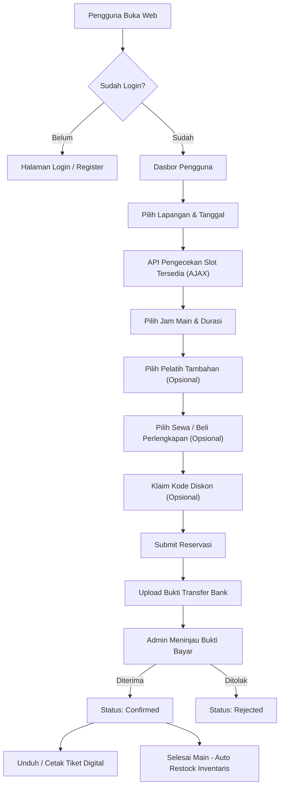
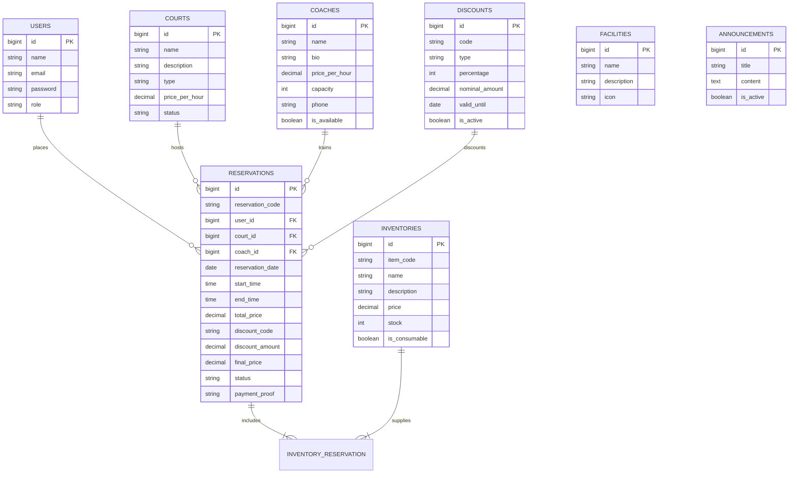

<div align="center">

# 🎾 Padel Arena — Court Reservation & Management System

**A modern, full-featured web-based reservation platform for padel clubs, players, coaches, and administrators.**

[](https://laravel.com)
[](https://php.net)
[](https://www.mysql.com/)
[](https://www.sqlite.org/)
[](LICENSE)

[Fitur Utama](#-fitur-utama) • [Data Seeder Siap Pakai](#-data-seeder-siap-pakai-minimal-10-item) • [Akun Demo](#-akun-demo-default) • [Teknologi](#-teknologi-yang-digunakan) • [Instalasi & Setup](#-panduan-instalasi--menjalankan-proyek) • [Testing](#-pengujian-automated-tests) • [Struktur Proyek](#-struktur-direktori)

</div>

---

## 📌 Tentang Proyek

**Padel Arena** adalah sistem informasi manajemen dan reservasi lapangan padel terintegrasi yang dibangun menggunakan **Laravel**. Aplikasi ini dirancang untuk memudahkan para pemain padel memesan lapangan dan perlengkapan secara online, memilih pelatih profesional, mengunggah bukti pembayaran, serta mencetak tiket booking digital.

Di sisi pengelola, admin memiliki kendali penuh melalui dasbor analitik real-time, manajemen lapangan, pelatih, inventaris (lengkap dengan QR Code generator), kode diskon, pengumuman, hingga fitur pencadangan (backup) dan pemulihan (restore) basis data.

Saat pertama kali dideploy atau di-setup, aplikasi telah dilengkapi dengan **Database Seeder lengkap** (minimal 10 item untuk setiap modul: lapangan, inventaris, pelatih, fasilitas, pengumuman, diskon, pengguna, dan riwayat transaksi) sehingga seluruh halaman dan grafik analitik langsung tampil interaktif tanpa harus input manual dari nol.

---

## ✨ Fitur Utama

### 👤 Portal Pengguna (Customer / Member)
- **Interactive Court Booking**: Pemilihan tanggal dan jam main (slot matrix 06:00 - 24:00) secara visual dengan pengecekan ketersediaan jadwal secara real-time melalui AJAX.
- **Coach Booking**: Pilihan pelatih profesional dengan kuota kapasitas harian/per-sesi otomatis agar tidak terjadi *overbooking*.
- **Add-on Rental & Pro Shop**: Sewa raket berbayar, pembelian bola kaleng resmi, handgrip anti-vibrasi, dan minuman isotonik dalam satu kali transaksi reservasi.
- **Voucher Diskon**: Penerapan kode promo otomatis (diskon persentase `%` maupun potongan nominal `Rp`).
- **Upload Bukti Bayar**: Konfirmasi pembayaran transfer bank dengan unggahan struk transfer.
- **Digital Ticket Pass**: Unduh dan cetak tiket reservasi digital yang memuat kode unik booking dan detail pesanan.
- **Manajemen Profil**: Pembaruan data akun, nomor telepon, dan ganti password.

### 🛡️ Panel Administrator
- **Dashboard Statistik Interaktif**: Metrik total pesanan, pengguna terdaftar, pendapatan kotor, utilisasi lapangan, tren pendapatan bulanan, dan grafik jam bermain paling populer.
- **Manajemen Reservasi**: Verifikasi pembayaran, konfirmasi pesanan, penolakan (reject), dan pembatalan dengan auto-restock barang sewaan.
- **Manajemen Lapangan (Courts)**: CRUD lapangan indoor/outdoor, pengaturan harga per jam, dan status pemeliharaan (maintenance).
- **Manajemen Pelatih (Coaches)**: Pengaturan tarif, bio, nomor kontak, batas kapasitas murid, dan ketersediaan pelatih.
- **Manajemen Inventaris & QR Code**: Pelacakan stok perlengkapan (consumable vs sewa), penyesuaian harga, serta **QR Code Generator** per item barang.
- **Manajemen Pengumuman (Announcements)**: Publikasi berita, event, dan turnamen yang tampil pada beranda dan dasbor pengguna.
- **Manajemen Diskon (Promotions)**: Pembuatan voucher promo dengan masa berlaku (validity period) dan batas nominal/persentase.
- **Manajemen User & Role**: Pengelolaan data pelanggan serta penambahan akun admin baru.
- **Database Backup & Restore**: Ekspor cadangan database ke format `.sql` dalam sekali klik serta pemulihan instan melalui unggah file `.sql`.

### 🌐 Multi-Language Support (i18n)
Dukungan penuh bilingual (**Bahasa Indonesia** dan **English**) yang dapat diganti kapan saja dengan satu klik melalui *language switcher*.

---

## 📦 Data Seeder Siap Pakai (Minimal 10+ Item)

Untuk kemudahan demonstrasi dan deployment langsung ke server produksi (seperti Vercel / VPS / Shared Hosting), database seeder menyertakan data riil lengkap:

### 1. 🎾 12 Lapangan Padel (Courts)
| No | Nama Lapangan | Tipe | Tarif / Jam | Status | Keunggulan Utama |
|:---:|:---|:---:|:---:|:---:|:---|
| 1 | **Center Court Pro (Arena 1)** | Indoor | Rp 280.000 | Available | Mondo Supercourt XN, Full Tempered Glass 12mm |
| 2 | **Indoor Panoramic Court A (Arena 2)** | Indoor | Rp 250.000 | Available | Konstruksi tanpa tiang sudut, Full AC |
| 3 | **Indoor Panoramic Court B (Arena 3)** | Indoor | Rp 250.000 | Available | Standar turnamen, peredam akustik |
| 4 | **Sunset Skyline Court 1 (Arena 4)** | Outdoor | Rp 180.000 | Available | View pemandangan senja kota |
| 5 | **Sunset Skyline Court 2 (Arena 5)** | Outdoor | Rp 180.000 | Available | Windbreak mesh pelindung angin kencang |
| 6 | **Rooftop Arena Alpha (Arena 6)** | Outdoor | Rp 200.000 | Available | Rooftop lantai 5 dengan lampu LED anti-glare |
| 7 | **Rooftop Arena Beta (Arena 7)** | Outdoor | Rp 200.000 | Available | Rooftop eksklusif dengan lounge pinggir lapangan |
| 8 | **Grand Slam Court (Arena 8)** | Indoor | Rp 260.000 | Available | Ceiling tinggi 12 meter bebas hambatan lob/smash |
| 9 | **Family & Beginner Court (Arena 9)** | Indoor | Rp 160.000 | Available | Pantulan moderat untuk pemula & anak-anak |
| 10 | **VIP Glass Pavilion (Arena 10)** | Indoor | Rp 350.000 | Available | Lapangan privat VIP, locker pribadi, smart scoreboard |
| 11 | **Championship Tour Court (Arena 11)** | Outdoor | Rp 220.000 | Available | Dilengkapi tribun penonton & kursi wasit resmi |
| 12 | **Training & Drill Court (Arena 12)** | Indoor | Rp 190.000 | Maintenance | Dilengkapi ball machine & video analysis camera |

### 2. 🎒 14 Inventaris & Pro Shop (Inventories)
| Kode Item | Nama Barang | Kategori | Harga | Stok | Tipe |
|:---:|:---|:---:|:---:|:---:|:---:|
| `INV-001` | Raket Babolat Technical Viper | Raket Pro | Rp 50.000 | 15 | Sewa |
| `INV-002` | Raket Bullpadel Vertex 03 | Raket Pro | Rp 50.000 | 15 | Sewa |
| `INV-003` | Raket Head Speed Pro | All-Around | Rp 45.000 | 20 | Sewa |
| `INV-004` | Raket Wilson Blade V2 | Intermediate | Rp 45.000 | 20 | Sewa |
| `INV-005` | Raket Kuikma PR 990 Precision | Beginner | Rp 35.000 | 25 | Sewa |
| `INV-006` | Bola Padel Head Padel Pro (Isi 3) | Bola Turnamen | Rp 110.000 | 60 | Consumable |
| `INV-007` | Bola Padel Bullpadel Premium Pro (Isi 3) | Bola Kompetisi | Rp 120.000 | 50 | Consumable |
| `INV-008` | Overgrip Wilson Pro Comfort (Pack isi 3) | Grip Raket | Rp 45.000 | 80 | Consumable |
| `INV-009` | Handgrip ShockOut Anti-Vibration | Aksesoris | Rp 65.000 | 40 | Consumable |
| `INV-010` | Minuman Isotonik Pocari Sweat 500ml | Minuman Dingin | Rp 12.000 | 150 | Consumable |
| `INV-011` | Hydro Coco Pure Coconut Water 330ml | Minuman Segar | Rp 15.000 | 100 | Consumable |
| `INV-012` | Air Mineral Pristine 8+ 600ml | Air Mineral | Rp 8.000 | 200 | Consumable |
| `INV-013` | Handuk Olahraga Microfiber Padel Arena | Apparel | Rp 35.000 | 75 | Consumable |
| `INV-014` | Wristband Sweatband Padel Arena | Aksesoris | Rp 25.000 | 60 | Consumable |

### 3. 👨‍🏫 11 Pelatih Profesional (Coaches)
| No | Nama Pelatih | Spesialisasi | Tarif / Jam | Kapasitas | Status |
|:---:|:---|:---|:---:|:---:|:---:|
| 1 | **Coach Bima Sakti** | Pro Padel Certified FIP, mantan atlet tenis nasional | Rp 150.000 | 4 Orang | Available |
| 2 | **Coach Sarah Az-Zahra** | Pemula, fundamental grip, & program padel anak-anak | Rp 120.000 | 6 Orang | Available |
| 3 | **Coach Anton Wijaya** | Master taktik ganda, rotasi lapangan, & match play | Rp 160.000 | 4 Orang | Available |
| 4 | **Coach Dita Kusuma** | Pelatih fisik, footwork agility, kelincahan gerak, & stamina | Rp 110.000 | 8 Orang | Available |
| 5 | **Coach Ricky Hartono (Pro)** | Level advanced bersertifikasi WPT (smash, vibora, & rulo) | Rp 250.000 | 2 Orang | Available |
| 6 | **Coach Carlos Rodriguez** | Head Coach Madrid Padel Academy Spanyol (10+ thn exp) | Rp 300.000 | 4 Orang | Available |
| 7 | **Coach Maya Indah** | Ladies Clinic, fun sparring ganda, & rally consistency | Rp 130.000 | 6 Orang | Available |
| 8 | **Coach Rendy Pratama** | Teknik pantulan dinding kaca (wall rebounds) & counter lob | Rp 140.000 | 4 Orang | Available |
| 9 | **Coach Gilang Ramadhan** | Pukulan serang agresif, duel netting, & return servis | Rp 150.000 | 4 Orang | Available |
| 10 | **Coach Nadia Safitri** | Fundamental padel junior & youth development asia | Rp 100.000 | 8 Orang | Available |
| 11 | **Coach Hendra Setiawan** | Reaksi refleks net play & blocking smash lawan | Rp 180.000 | 4 Orang | Penugasan Timnas |

### 4. 🏢 11 Fasilitas Arena (Facilities)
1. **Ruang Loker & Ganti Atlet**: Ber-AC, loker aman terpisah pria & wanita.
2. **Kamar Mandi Shower Air Panas**: Shower bertekanan air hangat lengkap dengan sabun & sampo.
3. **Free High-Speed Wi-Fi**: Koneksi internet nirkabel 200 Mbps mencakup seluruh area.
4. **Athlete Lounge & Kafe**: Kopi spesialti, jus segar, dan makanan sehat.
5. **Pro Shop & Rental Gear**: Penjualan raket, tas, aksesoris, dan jasa pasang overgrip.
6. **Musholla & Tempat Wudhu**: Bersih, sejuk, sajadah wangi, dan tempat wudhu terpisah.
7. **Area Parkir Mobil & Motor Luas**: Kapasitas 80+ mobil dan 100+ motor dengan CCTV 24 jam.
8. **Tribun Penonton Beratap**: Tempat duduk nyaman untuk penonton dan suporter turnamen.
9. **Pencahayaan LED FIP Turnamen**: Lampu sorot 800+ Lux anti-silau tanpa bayangan.
10. **Stasiun Pengisian Daya EV**: Charger kendaraan listrik tipe AC Charging 22 kW.
11. **Pos Medis & P3K Darurat**: Peralatan kompres es instan dan staf terlatih penanganan cedera.

### 5. 📢 10 Pengumuman & Berita (Announcements)
1. `Promo Grand Opening 50%` — Diskon pembukaan bulan pertama operasional.
2. `Turnamen Padel Arena Open 2026` — Registrasi turnamen tahunan ganda berhadiah jutaan rupiah.
3. `Weekend Social Morning Sparring` — Main bareng santai setiap Sabtu & Minggu pagi.
4. `Aturan Wajib Sepatu Sol Datar` — Penggunaan sepatu khusus padel/tenis untuk melindungi karpet Mondo.
5. `Perawatan Lapangan Rutin Setiap Senin` — Pembersihan dan penyisiran pasir silika terjadwal.
6. `Masterclass Clinic bersama Coach Carlos` — Sesi latihan mendalam bersama pelatih asal Spanyol.
7. `Program Member Baru: Gratis Sewa Raket` — Free rental voucher untuk reservasi pertama.
8. `Komunitas Padel Jakarta: Night Smash` — Gathering seru Rabu malam dengan live DJ.
9. `Holiday Junior Coaching Camp` — Program liburan sekolah untuk anak usia 7-16 tahun.
10. `Diskon Khusus Mahasiswa & Pelajar` — Potongan 10% dengan kartu pelajar aktif pada jam kerja.

### 6. 🎟️ 11 Kode Voucher Promo (Discounts)
| Kode Voucher | Tipe Diskon | Nilai Potongan | Masa Berlaku | Status |
|:---:|:---:|:---:|:---:|:---:|
| `WELCOME50` | Persentase | **50%** | 30 Hari | Aktif |
| `WEEKEND20` | Persentase | **20%** | 60 Hari | Aktif |
| `POTONGAN50RB` | Nominal | **Rp 50.000** | 45 Hari | Aktif |
| `STUDENT10` | Persentase | **10%** | Permanen | Aktif |
| `SMASH100K` | Nominal | **Rp 100.000** | 60 Hari | Aktif |
| `EARLYBIRD15` | Persentase | **15%** | 90 Hari | Aktif |
| `NIGHTOWL10` | Persentase | **10%** | 30 Hari | Aktif |
| `PADELMANIA25` | Persentase | **25%** | 40 Hari | Aktif |
| `PROMOTION30` | Persentase | **30%** | 20 Hari | Aktif |
| `FLASHDEAL75K` | Nominal | **Rp 75.000** | 15 Hari | Aktif |
| `EXPIRED5` | Persentase | **5%** | Telah Lewat | Nonaktif (Demo) |

### 7. 📋 16 Riwayat Reservasi Realistis
Seeder secara otomatis mengisi 16 riwayat pesanan (termasuk pesanan selesai 1-14 hari lalu, pesanan aktif hari ini, pesanan mendatang terkonfirmasi, pesanan pending menunggu verifikasi bukti transfer, serta pembatalan). Ini memastikan **grafik analitik dan metrik pendapatan pada dasbor admin langsung terisi indah sejak hari pertama aplikasi dijalankan**.

---

## 🔑 Akun Demo Default

Setelah menjalankan seeder, Anda dapat langsung masuk menggunakan akun-akun berikut:

| Peran (Role) | Nama Akun | Email Login | Password | Akses Fitur |
| :--- | :--- | :--- | :---: | :--- |
| **Super Admin** | Admin Padel Arena | `admin@maaafiqspadel.com` | `password` | Akses penuh dashboard, kelola seluruh data, backup & restore |
| **Staff Kasir** | Staff Operator & Kasir | `staff@maaafiqspadel.com` | `password` | Akses admin panel, verifikasi pembayaran, cek stok lapangan |
| **Member Demo** | Pengguna Demo | `user@maaafiqspadel.com` | `password` | Pemesanan lapangan, sewa raket, upload transfer, cetak tiket |
| **Customer 1** | Budi Santoso | `budi.santoso@gmail.com` | `password` | Akun pelanggan aktif |
| **Customer 2** | Siti Aminah | `siti.aminah@gmail.com` | `password` | Akun pelanggan aktif |
| **Customer 3** | Kevin Wijaya | `kevin.wijaya@gmail.com` | `password` | Akun pelanggan aktif |
| **Customer 4** | Amanda Putri | `amanda.putri@gmail.com` | `password` | Akun pelanggan aktif |
| **Customer 5** | Reza Rahadian | `reza.rahadian@gmail.com` | `password` | Akun pelanggan aktif |
| **Customer 6** | Clara Tan | `clara.tan@gmail.com` | `password` | Akun pelanggan aktif |
| **Customer 7** | Fajar Alfian | `fajar.alfian@gmail.com` | `password` | Akun pelanggan aktif |
| **Customer 8** | Greysia Polii | `greysia.polii@gmail.com` | `password` | Akun pelanggan aktif |
| **Customer 9** | Marcus Gideon | `marcus.gideon@gmail.com` | `password` | Akun pelanggan aktif |

> 💡 *Semua akun di atas menggunakan password default: `password`.*

---

## 🏗️ Alur Sistem & Arsitektur



---

## 🗄️ Skema Relasi Database (ERD)



---

## 💻 Teknologi yang Digunakan

- **Backend**: [Laravel 10](https://laravel.com)
- **Bahasa**: [PHP 8.1 / 8.2 / 8.3](https://php.net)
- **Database**: SQLite (Default cepat & portabel) atau MySQL 8.0
- **Frontend**: Blade Templating Engine, Vanilla CSS3, JavaScript ES6, [FontAwesome 6](https://fontawesome.com)
- **Chart Visual**: Chart.js untuk analitik grafik di admin panel
- **Testing**: [PHPUnit](https://phpunit.de) Test Framework
- **Deployment**: Vercel Serverless Ready (`vercel.json` & `api/index.php`)

---

## 🚀 Panduan Instalasi & Menjalankan Proyek

### 1. Prasyarat Sistem
- PHP >= 8.1 dengan ekstensi `pdo_sqlite`, `pdo_mysql`, `mbstring`, `fileinfo`, `openssl`
- Composer terinstal ([getcomposer.org](https://getcomposer.org))
- Git terinstal

### 2. Clone Repositori
```bash
git clone https://github.com/maaafiqs/padel-reservation.git
cd padel-reservation
```

### 3. Install Dependensi PHP
```bash
composer install
```

### 4. Konfigurasi Environment (`.env`)
Salin file `.env.example` menjadi `.env`:
```bash
cp .env.example .env
```
Lalu buat application key baru:
```bash
php artisan key:generate
```

Pilih database yang ingin Anda gunakan:

**Pilihan A — Menggunakan SQLite (Paling Cepat & Portabel):**
```env
DB_CONNECTION=sqlite
```
*(File SQLite otomatis berada di `database/database.sqlite`)*

**Pilihan B — Menggunakan MySQL (Laragon / XAMPP):**
```env
DB_CONNECTION=mysql
DB_HOST=127.0.0.1
DB_PORT=3306
DB_DATABASE=padel_reservation
DB_USERNAME=root
DB_PASSWORD=
```

### 5. Jalankan Migrasi & Database Seeder Lengkap
Jalankan satu perintah ini untuk mereset tabel dan memasukkan **seluruh 10+ data master dan akun**:
```bash
php artisan migrate:fresh --seed
```

### 6. Hubungkan Storage Link
```bash
php artisan storage:link
```

### 7. Jalankan Server Lokal
```bash
php artisan serve
```
Buka peramban web dan akses:
👉 **[http://localhost:8000](http://localhost:8000)**

---

## 🧪 Pengujian (Automated Tests)

Proyek ini telah dilengkapi dengan unit dan feature test otomatis untuk memverifikasi autentikasi, hak akses role, serta alur kalkulasi dan validasi reservasi:

```bash
# Menjalankan seluruh pengujian (14 passed)
php artisan test

# Menjalankan feature test autentikasi
php artisan test --filter=AuthenticationTest

# Menjalankan feature test reservasi lapangan
php artisan test --filter=ReservationTest
```

---

## 📁 Struktur Direktori

```text
padel-reservation/
├── app/
│   ├── Http/
│   │   ├── Controllers/
│   │   │   ├── Admin/             # Controller dasbor & CRUD Admin
│   │   │   ├── AuthController.php # Login, Register & Logout
│   │   │   ├── HomeController.php # Landing page
│   │   │   ├── LanguageController.php # Pergantian bahasa ID/EN
│   │   │   └── UserReservationController.php # Alur booking pengguna
│   │   └── Middleware/            # Role-based middleware (admin, user)
│   └── Models/                    # Court, Coach, Reservation, Inventory, Facility, dll.
├── database/
│   ├── migrations/                # Skema basis data
│   └── seeders/
│       ├── DatabaseSeeder.php     # Main seeder & Akun Demo
│       ├── DummyDataSeeder.php    # 12 Courts, 14 Inventories, 11 Coaches, 10 Announcements, 11 Discounts
│       ├── FacilitySeeder.php     # 11 Facilities
│       └── ReservationSeeder.php  # 16 Riwayat Reservasi & Transaksi
├── lang/
│   ├── en.json                    # Kamus terjemahan Bahasa Inggris
│   └── id.json                    # Kamus terjemahan Bahasa Indonesia
├── resources/
│   └── views/
│       ├── admin/                 # Panel kontrol admin & grafik statistik
│       ├── auth/                  # Form Login & Register
│       ├── components/            # Reusable Blade UI (badges, alert box)
│       ├── layouts/               # Master layout aplikasi
│       └── user/                  # Dashboard & form reservasi user
├── routes/
│   └── web.php                    # Deklarasi seluruh rute web
└── tests/
    └── Feature/                   # Test suite autentikasi & alur reservasi
```

---

## 📝 Konvensi Git Commit

Repositori ini mengikuti standar **Conventional Commits**:
- `feat:` Penambahan fitur atau seeder baru
- `fix:` Perbaikan bug kode atau tampilan
- `docs:` Pembaruan dokumentasi dan file README
- `chore:` Pemeliharaan dependensi, .gitignore, atau konfigurasi build
- `refactor:` Peningkatan struktur kode tanpa mengubah fungsi

---

## 📄 Lisensi

Proyek ini dilisensikan di bawah [MIT License](LICENSE).
Bebas digunakan, dimodifikasi, dan dikembangkan untuk keperluan akademik maupun komersial.

---

<div align="center">
  Dibuat dengan ❤️ untuk komunitas Padel Indonesia 🎾
</div>
